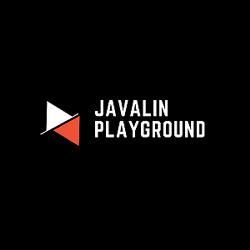

<H1> JAVALIN PLAYGROUND</H1>

Why Javalin?
    <li>Simple</li>
    <li>Lightweight</li>
    <li>Interoperable</li>
    <li>Flexible</li>

What is used in this project
<li><a href="https://javalin.io/">Javalin: </a>"Micro-Framework"</li> 
<li><a href="https://github.com/JetBrains/Exposed">Jetbrains-exposed: </a>ORM framework for Kotlin</li>
<li><a href="https://insert-koin.io/">Koin: </a>Smart Kotlin injection library</li>
<li><a href="https://kotest.io/">Kotest: </a>Flexible and elegant multiplatform test framework, assertions library, and property test library for Kotlin</li>
<li><a href="https://mockk.io/">Mockk: </a>Mocking library for Kotlin</li>

